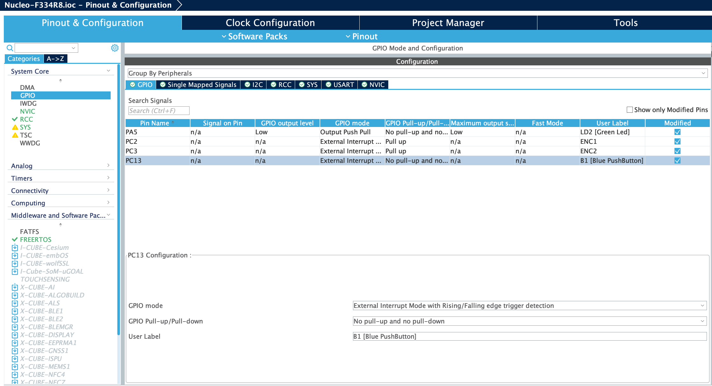
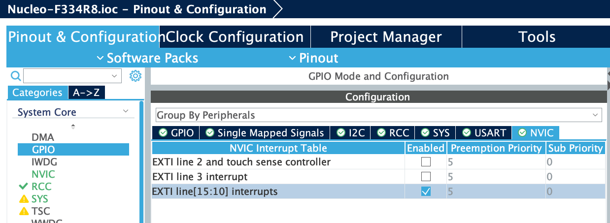
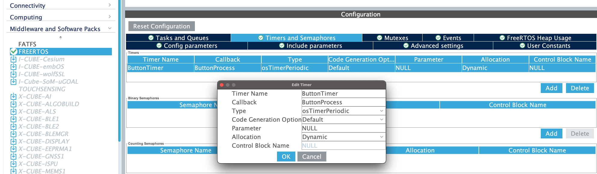

# STM32 Button Library

An STM32-based button library with built-in debouncing.
This project is a STM32-based library to help organize button actions and provide a simple software-based debouncing solution. When connecting buttons to microcontrollers a common problem engineers run into is _debouncing_: after pushing or releasing a button it will "bounce" between open and closed due to the electrical properties of the circuit. While it is possible to solve this problem in hardware, this library introduces a configurable, software-based debouncing solution that delays processing a button press until the bouncing has completed. This library also helps organize button actions buy introducing several higher-level concepts, such as long push, make organizing button actions easier.

> Based on [stm32_pushbutton](https://github.com/dretay/stm32_pushbutton) by [Drew Tayman](https://github.com/dretay). Completely rewrite state machine to react correctly on different push types (double press, long etc). This library emits exactly one event on each event type at the end on push action which is different to the original library.


### Main Features

- Completely written in C, making integration into RTOS and HAL projects easier.
- Built-in state machine ensures accurate button processing.
- Easy interface helps organize all button actions in a single location.

### Descritpion
There are several defines in the Button.h file to configure number of buttons, delays etc:
```c
// Pressed button pin state configuration: 1 - LOW, 0 - HIGH
#define BUTTON_PULLUP 1

// Max number of button
#define MAX_BUTTONS 3

// Defines the number of ticks before a value is considered legitimate
// Debounce time
#define DBNC_COUNTER_MAX 30
// Long press detected if button pressed longer than this constant
#define LONG_PRESS_DELAY 1000
// Very long press detected if button pressed longer than this constant
#define VERY_LONG_PRESS_DELAY LONG_PRESS_DELAY + 2000
// Double press detection max time
#define DOUBLE_PRESS_MAX_DELAY 600
```
There are four main fuctions in the library interface:
1. Initialize the library: must be called first
```c
static void init();
```
2. Register button is used to configure buttons. Here we can setup GPIO port and pin for the button and register callback functions, which will be called in case of appropriate push action on the button:
```c
static bool register_button(
	GPIO_TypeDef* gpio_port,
	uint16_t gpio_pin,
	void (*button_short_callback)(void),
	void (*button_long_callback)(void),
	void (*button_very_long_callback)(void),
	void (*button_double_callback)(void)
);
```
3. Main loop: used to process state machine. Must be called on the regular basis (for example in timer callback)

```c
	static void loop();
```
4. Button pins input read. Must be called on any button GPIO state change.
```c
static bool signal_state_change(uint16_t gpio_pin);
```

### Example setup
To use the library we have to properly setup everything needed. Let's configure one test button on the Nucleo-F334R8 board:
1. Configure GPIO for the button:

2. Enable interrupts for the configured GPIO:

3. Configure FreeRTOS timer:

4. Generate code for the configuration
5. Add button callback functions:
```c
// Test button setup begin
static unsigned int test_button_short = 0;
static unsigned int test_button_long = 0;
static unsigned int test_button_very_long = 0;
static unsigned int test_button_double = 0;

void test_button_short_callback(void) { test_button_short++;}
void test_button_long_callback(void) { test_button_long ++;}
void test_button_very_long_callback(void) { test_button_very_long++;}
void test_button_double_callback(void) { test_button_double++;}
// Test button setup end
```
5. Initialize library and register button in the main.c (after hardware initialization part of the generated main.c):
```c
/* USER CODE BEGIN 2 */
	Button.init();
	Button.register_button(
		B1_GPIO_Port,
		B1_Pin,
		&test_button_short_callback,
		&test_button_long_callback,
		&test_button_very_long_callback,
		&test_button_double_callback
	);
  /* USER CODE END 2 */
```
6. Add interrupt callback for processing button GPIO state change:
```c
void HAL_GPIO_EXTI_Callback(uint16_t GPIO_Pin)
{
	if (GPIO_Pin == B1_Pin)
			Button.signal_state_change(GPIO_Pin);
}
```
7. Start timer in main.c (in the timer initialization part of the generated main.c):
```c
  /* USER CODE BEGIN RTOS_TIMERS */
  /* start timers, add new ones, ... */
  osTimerStart(ButtonTimerHandle, 20);
  /* USER CODE END RTOS_TIMERS */
```
* Timer handler name is setup on step 3
* Timer is set to fire every 20ms in the example
8. Add main state machine loop function to the configured timer callback:
```c
/* ButtonProcess function */
void ButtonProcess(void *argument)
{
  /* USER CODE BEGIN ButtonProcess */
	Button.loop();
  /* USER CODE END ButtonProcess */
}
```
* Timer callback fuction name is setup on step 3